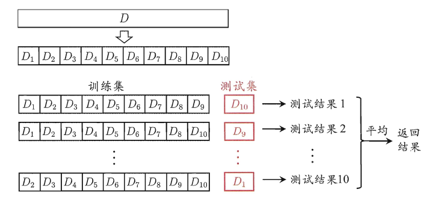
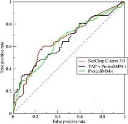

# 第一章 机器学习

## 1. 机器学习基础

### 1.1梯度下降法算法

#### 1. 机器学习中为什么需要梯度下降

梯度下降是机器学习中常见优化算法之一，梯度下降法有以下几个作用：

（1）梯度下降是迭代法的一种，可以用于求解最小二乘问题。

（2）在求解机器学习算法的模型参数，即无约束优化问题时，主要有梯度下降法（Gradient Descent）和最小二乘法。

（3）在求解损失函数的最小值时，可以通过梯度下降法来一步步的迭代求解，得到最小化的损失函数和模型参数值。

（4）如果我们需要求解损失函数的最大值，可通过梯度上升法来迭代。梯度下降法和梯度上升法可相互转换。

（5）在机器学习中，梯度下降法主要有随机梯度下降法和批量梯度下降法。

#### 2. 梯度下降法缺点

（1）靠近极小值时收敛速度减慢。

（2）直线搜索时可能会产生一些问题。

（3）可能会“之字形”地下降。

#### 3. 以线性回归为例的梯度下降推导

（1）假设线性回归的函数为：
$$
h_\theta(x_1,x_2,...,x_n)=\theta_0+\theta_1x_1+...+\theta_nx_n
$$
  其中，$\theta_i,x_i(i=0,1,2,...,n)$分别为模型参数、每个样本的特征值。
  对于假设函数，损失函数为：
$$
  J(\theta_0,\theta_1,...,\theta_n)=\frac{1}{2m}\sum^{m}_{j=0}(h_\theta (x^{(j)}_0
  	,x^{(j)}_1,...,x^{(j)}_n)-y_j)^2
$$
（2）相关参数初始化。
​	主要初始化${\theta}_i$、算法迭代步长${\alpha} $、终止距离${\zeta} $。初始化时可以根据经验初始化，即${\theta} $初始化为0，步长${\alpha} $初始化为1。当前步长记为${\varphi}_i $。当然，也可随机初始化。

（3）迭代计算。

​	1）计算当前位置时损失函数的梯度，对${\theta}_i $，其梯度表示为：
$$
\frac{\partial}{\partial \theta_i}J({\theta}_0,{\theta}_1,...,{\theta}_n)=\frac{1}{2m}\sum^{m}_{j=0}(h_\theta (x^{(j)}_0
	,x^{(j)}_1,...,x^{(j)}_n)-y_j)^2
$$
​	2）计算当前位置下降的距离。
$$
{\varphi}_i={\alpha} \frac{\partial}{\partial \theta_i}J({\theta}_0,{\theta}_1,...,{\theta}_n)
$$
​	3）判断是否终止。
​	确定是否所有${\theta}_i$梯度下降的距离${\varphi}_i$都小于终止距离${\zeta}$，如果都小于${\zeta}$，则算法终止，当然的值即为最终结果，否则进入下一步。
​	4）更新所有的${\theta}_i$，更新后的表达式为：
$$
{\theta}_i={\theta}_i-\alpha \frac{\partial}{\partial \theta_i}J({\theta}_0,{\theta}_1,...,{\theta}_n)
$$

$$
\theta_i=\theta_i - \alpha \frac{1}{m} \sum^{m}_{j=0}(h_\theta (x^{(j)}_0
	,x^{(j)}_1,...,x^{(j)}_n)-y_j)x^{(j)}_i
$$

​	5）令上式$x^{(j)}_0=1$，更新完毕后转入1)。
​	由此，可看出，当前位置的梯度方向由所有样本决定，上式中 $\frac{1}{m}$、$\alpha \frac{1}{m}$ 的目的是为了便于理解。

#### 4. 梯度下降调优方法

（1）**算法迭代步长$\alpha$选择。**
	在算法参数初始化时，有时根据经验将步长初始化为1。实际取值取决于数据样本。可以从大到小，多取一些值，分别运行算法看迭代效果，如果损失函数在变小，则取值有效。如果取值无效，说明要增大步长。但步长太大，有时会导致迭代速度过快，错过最优解。步长太小，迭代速度慢，算法运行时间长。

（2）**参数的初始值选择。**
	初始值不同，获得的最小值也有可能不同，梯度下降有可能得到的是局部最小值。如果损失函数是凸函数，则一定是最优解。由于有局部最优解的风险，需要多次用不同初始值运行算法，关键损失函数的最小值，选择损失函数最小化的初值。

（3）**标准化处理。**
	由于样本不同，特征取值范围也不同，导致迭代速度慢。为了减少特征取值的影响，可对特征数据标准化，使新期望为0，新方差为1，可节省算法运行时间。

#### 5. 各种梯度下降法性能比较

随机梯度下降（SGD）、批量梯度下降（BGD）、小批量梯度下降（Mini-batch GD）、和Online GD的区别：

|                |    BGD     |   SGD    | Mini-batch GD |   Online GD    |
| :------------: | :--------: | :------: | :-----------: | :------------: |
|     训练集     |    固定    |   固定   |     固定      |    实时更新    |
| 单次迭代样本数 | 整个训练集 | 单个样本 | 训练集的子集  | 根据具体算法定 |
|   算法复杂度   |     高     |    低    |     一般      |       低       |
|     时效性     |     低     |   一般   |     一般      |       高       |
|     收敛性     |    稳定    |  不稳定  |    较稳定     |     不稳定     |

Online GD于Mini-batch GD/SGD的区别在于，所有训练数据只用一次，然后丢弃。这样做的优点在于可预测最终模型的变化趋势。

Online GD在互联网领域用的较多，比如搜索广告的点击率（CTR）预估模型，网民的点击行为会随着时间改变。用普通的BGD算法（每天更新一次）一方面耗时较长（需要对所有历史数据重新训练）；另一方面，无法及时反馈用户的点击行为迁移。而Online GD算法可以实时的依据网民的点击行为进行迁移。

### 1.2  误差、偏差和方差

**Error **：

- 误差（error）：一般地，我们把学习器的实际预测输出与样本的真是输出之间的差异称为“误差”。
- Error = Bias + Variance + Noise，Error反映的是整个模型的准确度。

**Noise:**

噪声：描述了在当前任务上任何学习算法所能达到的期望泛化误差的下界，即刻画了学习问题本身的难度。

**Bias：**

- Bias衡量模型拟合训练数据的能力（训练数据不一定是整个 training dataset，而是只用于训练它的那一部分数据，例如：mini-batch），Bias反映的是模型在样本上的输出与真实值之间的误差，即模型本身的精准度。
- Bias 越小，拟合能力越高（可能产生overfitting）；反之，拟合能力越低（可能产生underfitting）。
- 偏差越大，越偏离真实数据，如下图第二行所示。

**Variance：**

- 方差公式：$S_{N}^{2}=\frac{1}{N}\sum_{i=1}^{N}(x_{i}-\bar{x})^{2}$
- Variance描述的是预测值的变化范围，离散程度，也就是离其期望值的距离。方差越大，数据的分布越分散，模型的稳定程度越差。
- Variance反映的是模型每一次输出结果与模型输出期望之间的误差，即模型的稳定性。
- Variance越小，模型的泛化的能力越高；反之，模型的泛化的能力越低。
- 如果模型在训练集上拟合效果比较优秀，但是在测试集上拟合效果比较差劣，则方差较大，说明模型的稳定程度较差，出现这种现象可能是由于模型对训练集过拟合造成的。

**经验误差**（empirical error）：也叫训练误差（training error），模型在训练集上的误差。 

**泛化误差**（generalization error）：模型在新样本集（测试集）上的误差称为“泛化误差”。

### 1.3 过拟合与欠拟合

#### 1. 图解过拟合欠拟合

横轴为训练样本数量，纵轴为误差

模型欠拟合：在训练集以及测试集上同时具有较高的误差，此时模型的**偏差较大**；

模型过拟合：在训练集上具有较低的误差，在测试集上具有较高的误差，此时模型的**方差较大**。

模型正常：在训练集以及测试集上，同时具有相对较低的偏差以及方差。

#### 2. 欠拟合解决方法

1. 添加其他特征项。组合、泛化、相关性、上下文特征、平台特征等特征是特征添加的重要手段，有时候特征项不够会导致模型欠拟合。
2. 添加多项式特征。例如将线性模型添加二次项或三次项使模型泛化能力更强。例如，FM（Factorization Machine）模型、FFM（Field-aware Factorization Machine）模型，其实就是线性模型，增加了二阶多项式，保证了模型一定的拟合程度。
3. 可以增加模型的复杂程度。
4. 减小正则化系数。正则化的目的是用来防止过拟合的，但是现在模型出现了欠拟合，则需要减少正则化参数。

#### 3. 过拟合解决方法 

1. 重新清洗数据，数据不纯会导致过拟合，此类情况需要重新清洗数据。 
2. 增加训练样本数量。 
3. 降低模型复杂程度。 
4. 增大正则项系数。 
5. 采用dropout方法，dropout方法，通俗的讲就是在训练的时候让神经元以一定的概率不工作。 
6. early stopping。 
7. 减少迭代次数。 
8. 增大学习率。 
9. 添加噪声数据。 
10. 树结构中，可以对树进行剪枝。 
11. 减少特征项。

### 1.4 交叉验证

#### 1. 交叉验证的作用

交叉验证（cross validation）的基本思想就是重复地利用同一份数据。通过划分训练集和测试集，一定程度上减小了过拟合；重复使用数据，尽可能多的从样本集上得到有用的信息。

#### 2. 交叉验证的主要方法

**简单交叉验证**

简单交叉验证，又称为留出法（hold-out），是指直接将样本集划分成两个互斥的计划，其中一个作为训练集（training set），另外一个作为测试集(testing set)。在训练集中进行学习训练，使用测试集来计算测试误差。
注意：
1）训练集和测试集中的数据分布要尽量与原始样本集一致，因此需要使用**分层抽样（stratified sampling）**的方式划分。
2）单次划分得到的结果进行学习产生的模型往往不够稳定可能，因此需要**多次随机划分、重复进行实验评估**后计算平均值来作为评估结果。
3）常用的划分比例为7:3或者8:2。

**K折交叉验证**

K折交叉验证（K-fold cross validation），是指将数据集划分成K个大小相近的互斥子集，每次选取其中的一个子集作为测试集，其他K-1个子集作为测试集，这样就可以得到K种选择结果，从而可以进行K次学习和预测，最终返回这K次测试结果的均值。

注意：
1）评估结果的稳定性很大程度上取决于K的取值，最常用的取值为10，其次为5和20等；
2）每个子集尽量保持数据分布一致，因此需要使用**分层抽样**；
3）和简单交叉验证一样，数据集的划分结果会可能影响模型最终的结果，为了减少这种划分带来的差异，可以重复进行p次划分，进行p次K折交叉验证，最终取这p次的平均评估结果。

**留一交叉验证**

留一交叉验证法，简称留一法（Leave-One-Out,LOO）,它是一种特殊的K折交叉验证，K=样本数N。因为每次只保留一个样本进行测试，因此，留一法不受随机样本划分的影响，构建的模型与原始样本集构建的模型很相似，因此，其评估结果也认为很准确。但是其缺陷是，当样本集很大时，训练N个模型的计算开销将非常大。因此，在数据量相对缺乏时，可以采用。

### 1.5 模型评估方法

#### 1. 分类模型常用评估方法

|       指标       |               描述               |
| :--------------: | :------------------------------: |
|     Accuracy     |              准确率              |
|    Precision     |          精准度/查准率           |
|      Recall      |          召回率/查全率           |
|     P-R曲线      | 查准率为纵轴，查全率为横轴，作图 |
|        F1        |               F1值               |
| Confusion Matrix |             混淆矩阵             |
|       ROC        |             ROC曲线              |
|       AUC        |         ROC曲线下的面积          |

#### 2. 回归模型常用评估方法

|             指标              |   描述   |
| :---------------------------: | :------: |
| Mean Square Error (MSE, RMSE) | 平均方差 |
|   Absolute Error (MAE, RAE)   | 绝对误差 |
|           R-Squared           | R平方值  |

#### 3. 查准率与查全率

将算法预测的结果分成四种情况： 

1. 正确肯定（True Positive,TP）：预测为真，实际为真 
2. 正确否定（True Negative,TN）：预测为假，实际为假 
3. 错误肯定（False Positive,FP）：预测为真，实际为假 
4. 错误否定（False Negative,FN）：预测为假，实际为真

**查准率**（Precision）=TP/（TP+FP）

**理解**：预测出为阳性的样本中，正确的有多少。区别准确率（正确预测出的样本，包括正确预测为阳性、阴性，占总样本比例）。
例，在所有我们预测有恶性肿瘤的病人中，实际上有恶性肿瘤的病人的百分比，越高越好。 

**查全率**（Recall）=TP/（TP+FN）

**理解**：正确预测为阳性的数量占总样本中阳性数量的比例。
例，在所有实际上有恶性肿瘤的病人中，成功预测有恶性肿瘤的病人的百分比，越高越好。

#### 4. ROC与AUC

ROC全称是“受试者工作特征”（Receiver Operating Characteristic）。ROC曲线的面积就是AUC（Area Under Curve）。AUC用于衡量“二分类问题”机器学习算法性能（泛化能力）。

ROC曲线，通过将连续变量设定出多个不同的临界值，从而计算出一系列真正率和假正率，再以假正率为横坐标、真正率为纵坐标绘制成曲线，曲线下面积越大，推断准确性越高。在ROC曲线上，最靠近坐标图左上方的点为假正率和真正率均较高的临界值。 

对于分类器，或者说分类算法，评价指标主要有Precision，Recall，F-score。下图是一个ROC曲线的示例。

ROC曲线的横坐标为False Positive Rate（FPR），纵坐标为True Positive Rate（TPR）。其中
$$
TPR = \frac{TP}{TP+FN} ,FPR = \frac{FP}{FP+TN}
$$

- (0,0)：TP=0，FP=0，可以发现该分类器预测所有的样本都为负样本(Negative)
- (1,1)：TN=0，FN=0，可以发现该分类器预测所有的样本都为正样本(Positive)
- (0,1)：FP=0，FN=0，它将所有的样本都正确分类
- (1,0)：TP=0，TN=0，它将所有的样本都错误分类

如果ROC曲线越靠近左上方，那么分类器的效果越好。进行学习器的比较时，若一个分类器的ROC曲线完全包住另一个分类器，那么可以判断前者的性能更好。

#### 5. ROC和AUC特性

当测试集中的正负样本的分布变换的时候，ROC曲线能够保持不变。在实际的数据集中经常会出现样本类不平衡，即正负样本比例差距较大，而且测试数据中的正负样本也可能随着时间变化。

### 1.6 标准差和方差

- 方差公式为：$S^2_{N}=\frac{1}{N}\sum_{i=1}^{N}(x_{i}-\bar{x})^{2}$

- 标准差公式为：$S_{N}=\sqrt{\frac{1}{N}\sum_{i=1}^{N}(x_{i}-\bar{x})^{2}}$

- 样本标准差公式为：$S_{N}=\sqrt{\frac{1}{N-1}\sum_{i=1}^{N}(x_{i}-\bar{x})^{2}}$

与方差相比，使用标准差来表示数据点的离散程度有3个好处：

1. 表示离散程度的数字与样本数据点的数量级一致，更适合对数据样本形成感性认知。

2. 表示离散程度的数字单位与样本数据的单位一致，更方便做后续的分析运算。

3. 在样本数据大致符合正态分布的情况下，标准差具有方便估算的特性：68%的数据点落在平均值前后1个标准差的范围内、95%的数据点落在平均值前后2个标准差的范围内，而99%的数据点将会落在平均值前后3个标准差的范围内。

### 1.7 类别不平衡问题

类别不平衡（class-imbalance）是指分类任务中不同类别的训练样例数目差别很大的情况。 

**产生原因：**分类学习算法通常都会假设不同类别的训练样例数目基本相同。如果不同类别的训练样例数目差别很大，则会影响学习结果，测试结果变差。例如二分类问题中有998个反例，正例有2个，那学习方法只需返回一个永远将新样本预测为反例的分类器，就能达到99.8%的精度；然而这样的分类器没有价值。

**解决方法**

1、扩大数据集

​	增加包含小类样本数据的数据，更多的数据能得到更多的分布信息。

2、对大类数据欠采样

​	减少大类数据样本个数，使与小样本个数接近。
​	缺点：欠采样操作时若随机丢弃大类样本，可能会丢失重要信息。 
​	代表算法：EasyEnsemble。其思想是利用集成学习机制，将大类划分为若干个集合供不同的学习器使用。相当于对每个学习器都进行欠采样，但对于全局则不会丢失重要信息。

3、对小类数据过采样

​	过采样：对小类的数据样本进行采样来增加小类的数据样本个数。 

​	代表算法：SMOTE和ADASYN。 

​	SMOTE：通过对训练集中的小类数据进行插值来产生额外的小类样本数据。

​	新的少数类样本产生的策略：对每个少数类样本a，在a的最近邻中随机选一个样本b，然后在a、b之间的连线上随机选一点作为新合成的少数类样本。 	
​	ADASYN：根据学习难度的不同，对不同的少数类别的样本使用加权分布，对于难以学习的少数类的样本，产生更多的综合数据。 通过减少类不平衡引入的偏差和将分类决策边界自适应地转移到困难的样本两种手段，改善了数据分布。

4、使用新评价指标

​	如果当前评价指标不适用，则应寻找其他具有说服力的评价指标。比如准确度这个评价指标在类别不均衡的分类任务中并不适用，甚至进行误导。因此在类别不均衡分类任务中，需要使用更有说服力的评价指标来对分类器进行评价。

5、选择新算法

​	不同的算法适用于不同的任务与数据，应该使用不同的算法进行比较。

6、数据代价加权

​	例如当分类任务是识别小类，那么可以对分类器的小类样本数据增加权值，降低大类样本的权值，从而使得分类器将重点集中在小类样本身上。

7、转化问题思考角度

​	例如在分类问题时，把小类的样本作为异常点，将问题转化为异常点检测或变化趋势检测问题。 异常点检测即是对那些罕见事件进行识别。变化趋势检测区别于异常点检测在于其通过检测不寻常的变化趋势来识别。	

8、将问题细化分析

​	对问题进行分析与挖掘，将问题划分成多个更小的问题，看这些小问题是否更容易解决。 

## 2. 机器学习算法

### 2.1 决策树

​	决策树（Decision Tree）是一种分而治之的决策过程。一个困难的预测问题，通过树的分支节点，被划分成两个或多个较为简单的子集，从结构上划分为不同的子问题。将依规则分割数据集的过程不断递归下去（Recursive Partitioning）。随着树的深度不断增加，分支节点的子集越来越小，所需要提的问题数也逐渐简化。当分支节点的深度或者问题的简单程度满足一定的停止规则（Stopping Rule）时, 该分支节点会停止分裂，此为自上而下的停止阈值（Cutoff Threshold）法；有些决策树也使用自下而上的剪枝（Pruning）法。

#### 1. 决策树的三要素

1、特征选择：从训练数据中众多的特征中选择一个特征作为当前节点的分裂标准，如何选择特征有着很多不同量化评估标准，从而衍生出不同的决策树算法。 

2、决策树生成：根据选择的特征评估标准，从上至下递归地生成子节点，直到数据集不可分则决策树停止生长。树结构来说，递归结构是最容易理解的方式。 

3、剪枝：决策树容易过拟合，一般来需要剪枝，缩小树结构规模、缓解过拟合。剪枝技术有预剪枝和后剪枝两种。

#### 2. 算法步骤

#### 3. 决策树优缺点

**决策树算法的优点**：  

1、决策树算法易理解，机理解释起来简单。 

2、决策树算法可以用于小数据集。

3、决策树算法的时间复杂度较小，为用于训练决策树的数据点的对数。

4、相比于其他算法智能分析一种类型变量，决策树算法可处理数字和数据的类别。

5、能够处理多输出的问题。 

6、对缺失值不敏感。

7、可以处理不相关特征数据。

8、效率高，决策树只需要一次构建，反复使用，每一次预测的最大计算次数不超过决策树的深度。

**决策树算法的缺点**： 

1、对连续性的字段比较难预测。

2、容易出现过拟合。

3、当类别太多时，错误可能就会增加的比较快。

4、在处理特征关联性比较强的数据时表现得不是太好。

5、对于各类别样本数量不一致的数据，在决策树当中，信息增益的结果偏向于那些具有更多数值的特征。

#### 4. 剪枝处理的作用及策略

剪枝处理是决策树学习算法用来解决过拟合问题的一种办法。

在决策树算法中，为了尽可能正确分类训练样本， 节点划分过程不断重复， 有时候会造成决策树分支过多，以至于将训练样本集自身特点当作泛化特点， 而导致过拟合。 因此可以采用剪枝处理来去掉一些分支来降低过拟合的风险。 

剪枝的基本策略有预剪枝（pre-pruning）和后剪枝（post-pruning）。

预剪枝：在决策树生成过程中，在每个节点划分前先估计其划分后的泛化性能， 如果不能提升，则停止划分，将当前节点标记为叶结点。 

后剪枝：生成决策树以后，再自下而上对非叶结点进行考察， 若将此节点标记为叶结点可以带来泛化性能提升，则修改之。

### 2.2 支持向量机

**支持向量:**   在求解的过程中，会发现只根据部分数据就可以确定分类器，这些数据称为支持向量。

支持向量机是一种二分类模型，它的目的是寻找一个超平面来对样本进行分割，分割的原则是边界最大化，最终转化为一个凸二次规划问题来求解。

**线性分类:  ** 在训练数据中，每个数据都有n个的属性和一个二分类类别标志，我们可以认为这些数据在一个n维空间里。我们的目标是找到一个n-1维的超平面，这个超平面可以将数据分成两部分，每部分数据都属于同一个类别。这样的超平面有很多，假如我们要找到一个最佳的超平面。此时，增加一个约束条件：要求这个超平面到每边最近数据点的距离是最大的，成为最大边距超平面。这个分类器即为最大边距分类器。

**非线性分类：**  SVM的一个优势是支持非线性分类。它结合使用拉格朗日乘子法（Lagrange Multiplier）和KKT（Karush Kuhn Tucker）条件，以及核函数可以生成非线性分类器。

#### 1. 核函数特点及其作用

引入核函数目的：把原坐标系里线性不可分的数据用核函数Kernel投影到另一个空间，尽量使得数据在新的空间里线性可分。   

1）核函数的引入避免了“维数灾难”，大大减小了计算量。而输入空间的维数n对核函数矩阵无影响。因此，核函数方法可以有效处理高维输入。

2）无需知道非线性变换函数Φ的形式和参数。

3）核函数的形式和参数的变化会隐式地改变从输入空间到特征空间的映射，进而对特征空间的性质产生影响，最终改变各种核函数方法的性能。

4）核函数方法可以和不同的算法相结合，形成多种不同的基于核函数技术的方法，且这两部分的设计可以单独进行，并可以为不同的应用选择不同的核函数和算法。

#### 2. SVM为什么引入对偶问题

1，对偶问题将原始问题中的约束转为了对偶问题中的等式约束，对偶问题往往更加容易求解。

2，可以很自然的引用核函数（拉格朗日表达式里面有内积，而核函数也是通过内积进行映射的）。

3，在优化理论中，目标函数 f(x) 会有多种形式：如果目标函数和约束条件都为变量 x 的线性函数，称该问题为线性规划；如果目标函数为二次函数，约束条件为线性函数，称该最优化问题为二次规划；如果目标函数或者约束条件均为非线性函数，称该最优化问题为非线性规划。每个线性规划问题都有一个与之对应的对偶问题，对偶问题有非常良好的性质，以下列举几个：

​	a, 对偶问题的对偶是原问题；

​	b, 无论原始问题是否是凸的，对偶问题都是凸优化问题；

​	c, 对偶问题可以给出原始问题一个下界；

​	d, 当满足一定条件时，原始问题与对偶问题的解是完全等价的。

#### 3. SVM公式推导

#### 4. SVM主要特点

(1)  SVM方法的理论基础是非线性映射，SVM利用内积核函数代替向高维空间的非线性映射。  
(2)  SVM的目标是对特征空间划分得到最优超平面，SVM方法核心是最大化分类边界。  
(3)  支持向量是SVM的训练结果，在SVM分类决策中起决定作用的是支持向量。  
(4)  SVM是一种有坚实理论基础的新颖的适用小样本学习方法。它基本上不涉及概率测度及大数定律等，也简化了通常的分类和回归等问题。
(5)  SVM的最终决策函数只由少数的支持向量所确定，计算的复杂性取决于支持向量的数目，而不是样本空间的维数，这在某种意义上避免了“维数灾难”。  
(6)  少数支持向量决定了最终结果，这不但可以帮助我们抓住关键样本、“剔除”大量冗余样本,而且注定了该方法不但算法简单，而且具有较好的“鲁棒性”。这种鲁棒性主要体现在：
  ①增、删非支持向量样本对模型没有影响;  
  ②支持向量样本集具有一定的鲁棒性;  
  ③有些成功的应用中，SVM方法对核的选取不敏感  
(7)  SVM学习问题可以表示为凸优化问题，因此可以利用已知的有效算法发现目标函数的全局最小值。而其他分类方法（如基于规则的分类器和人工神经网络）都采用一种基于贪心学习的策略来搜索假设空间，这种方法一般只能获得局部最优解。  
(8)  SVM通过最大化决策边界的边缘来控制模型的能力。尽管如此，用户必须提供其他参数，如使用核函数类型和引入松弛变量等。 
(9)  SVM在小样本训练集上能够得到比其它算法好很多的结果。SVM优化目标是结构化风险最小，而不是经验风险最小，避免了过拟合问题，通过margin的概念，得到对数据分布的结构化描述，减低了对数据规模和数据分布的要求，有优秀的泛化能力。  
(10)  它是一个凸优化问题，因此局部最优解一定是全局最优解的优点。  

#### 5. SVM主要缺点

(1) SVM算法对大规模训练样本难以实施  
​        SVM的空间消耗主要是存储训练样本和核矩阵，由于SVM是借助二次规划来求解支持向量，而求解二次规划将涉及m阶矩阵的计算（m为样本的个数），当m数目很大时该矩阵的存储和计算将耗费大量的机器内存和运算时间。 如果数据量很大，SVM的训练时间就会比较长，如垃圾邮件的分类检测，没有使用SVM分类器，而是使用简单的朴素贝叶斯分类器，或者是使用逻辑回归模型分类。

(2) 用SVM解决多分类问题存在困难

​        经典的支持向量机算法只给出了二类分类的算法，而在实际应用中，一般要解决多类的分类问题。可以通过多个二类支持向量机的组合来解决。主要有一对多组合模式、一对一组合模式和SVM决策树；再就是通过构造多个分类器的组合来解决。主要原理是克服SVM固有的缺点，结合其他算法的优势，解决多类问题的分类精度。如：与粗糙集理论结合，形成一种优势互补的多类问题的组合分类器。

(3) 对缺失数据敏感，对参数和核函数的选择敏感

​        支持向量机性能的优劣主要取决于核函数的选取，所以对于一个实际问题而言，如何根据实际的数据模型选择合适的核函数从而构造SVM算法。目前比较成熟的核函数及其参数的选择都是人为的，根据经验来选取的，带有一定的随意性。在不同的问题领域，核函数应当具有不同的形式和参数，所以在选取时候应该将领域知识引入进来，但是目前还没有好的方法来解决核函数的选取问题。

#### 6. 逻辑回归与SVM的异同

**相同点：**

- LR和SVM都是**分类**算法。
- LR和SVM都是**监督学习**算法。
- LR和SVM都是**判别模型**。
- 如果不考虑核函数，LR和SVM都是**线性分类**算法，也就是说他们的分类决策面都是线性的。
  说明：LR也是可以用核函数的.但LR通常不采用核函数的方法。（**计算量太大**）

**不同点：**

**1、LR采用log损失，SVM采用合页(hinge)损失。**
逻辑回归的损失函数：
$$
J(\theta)=-\frac{1}{m}\sum^m_{i=1}\left[y^{i}logh_{\theta}(x^{i})+ (1-y^{i})log(1-h_{\theta}(x^{i}))\right]
$$
支持向量机的目标函数:
$$
L(w,n,a)=\frac{1}{2}||w||^2-\sum^n_{i=1}\alpha_i \left( y_i(w^Tx_i+b)-1\right)
$$
​	逻辑回归方法基于概率理论，假设样本为1的概率可以用sigmoid函数来表示，然后通过**极大似然估计**的方法估计出参数的值。  
​	支持向量机基于几何**边界最大化**原理，认为存在最大几何边界的分类面为最优分类面。

2、**LR对异常值敏感，SVM对异常值不敏感**。

​	支持向量机只考虑局部的边界线附近的点，而逻辑回归考虑全局。LR模型找到的那个超平面，是尽量让所有点都远离他，而SVM寻找的那个超平面，是只让最靠近中间分割线的那些点尽量远离，即只用到那些支持向量的样本。 
​	支持向量机改变非支持向量样本并不会引起决策面的变化。  
​	逻辑回归中改变任何样本都会引起决策面的变化。  

3、**计算复杂度不同。对于海量数据，SVM的效率较低，LR效率比较高**

​	当样本较少，特征维数较低时，SVM和LR的运行时间均比较短，SVM较短一些。准确率的话，LR明显比SVM要高。当样本稍微增加些时，SVM运行时间开始增长，但是准确率赶超了LR。SVM时间虽长，但在可接受范围内。当数据量增长到20000时，特征维数增长到200时，SVM的运行时间剧烈增加，远远超过了LR的运行时间。但是准确率却和LR相差无几。(这其中主要原因是大量非支持向量参与计算，造成SVM的二次规划问题)

4、**对非线性问题的处理方式不同**

​	LR主要靠特征构造，必须组合交叉特征，特征离散化。SVM也可以这样，还可以通过核函数kernel（因为只有支持向量参与核计算，计算复杂度不高）。由于可以利用核函数，SVM则可以通过对偶求解高效处理。LR则在特征空间维度很高时，表现较差。

5、**SVM的损失函数就自带正则**。  
​	损失函数中的1/2||w||^2项，这就是为什么SVM是结构风险最小化算法的原因！！！而LR必须另外在损失函数上添加正则项！！！**

6、SVM自带**结构风险最小化**，LR则是**经验风险最小化**。

7、SVM会用核函数而LR一般不用核函数。

### 3. 线性回归

### 4. 逻辑回归

### 5. 贝叶斯分类器

#### 1. 极大似然估计原理

极大似然估计的目的就是：利用已知的样本结果，反推最有可能（最大概率）导致这样结果的参数值。

​	极大似然估计是建立在极大似然原理的基础上的一个统计方法。极大似然估计提供了一种给定观察数据来评估模型参数的方法，即：“模型已定，参数未知”。通过若干次试验，观察其结果，利用试验结果得到某个参数值能够使样本出现的概率为最大，则称为极大似然估计。

​	由于样本集中的样本都是独立同分布，可以只考虑一类样本集$D$，来估计参数向量$\vec\theta$。记已知的样本集为：
$$
D=\vec x_{1},\vec x_{2},...,\vec x_{n}
$$
似然函数（likelihood function）：联合概率密度函数$p(D|\vec\theta )$称为相对于$\vec x_{1},\vec x_{2},...,\vec x_{n}$的$\vec\theta$的似然函数。
$$
l(\vec\theta )=p(D|\vec\theta ) =p(\vec x_{1},\vec x_{2},...,\vec x_{n}|\vec\theta )=\prod_{i=1}^{n}p(\vec x_{i}|\vec \theta )
$$
如果$\hat{\vec\theta}$是参数空间中能使似然函数$l(\vec\theta)$最大的$\vec\theta$值，则$\hat{\vec\theta}$应该是“最可能”的参数值，那么$\hat{\vec\theta}$就是$\theta$的极大似然估计量。它是样本集的函数，记作：
$$
\hat{\vec\theta}=d(D)= \mathop {\arg \max}_{\vec\theta} l(\vec\theta )
$$
$\hat{\vec\theta}(\vec x_{1},\vec x_{2},...,\vec x_{n})$称为极大似然函数估计值。

#### 2. 贝叶斯分类器基本原理

贝叶斯决策论通过**相关概率已知**的情况下利用**误判损失**来选择最优的类别分类。  
假设有$N$种可能的分类标记，记为$Y=\{c_1,c_2,...,c_N\}$，那对于样本$\boldsymbol{x}$，它属于哪一类呢？

计算步骤如下：

step 1. 算出样本$\boldsymbol{x}$属于第i个类的概率，即$P(c_i|x)$；

step 2. 通过比较所有的$P(c_i|\boldsymbol{x})$，得到样本$\boldsymbol{x}$所属的最佳类别。

step 3. 将类别$c_i$和样本$\boldsymbol{x}$代入到贝叶斯公式中，得到：
$$
P(c_i|\boldsymbol{x})=\frac{P(\boldsymbol{x}|c_i)P(c_i)}{P(\boldsymbol{x})}.
$$
​	一般来说，$P(c_i)$为先验概率，$P(\boldsymbol{x}|c_i)$为条件概率，$P(\boldsymbol{x})$是用于归一化的证据因子。对于$P(c_i)$可以通过训练样本中类别为$c_i$的样本所占的比例进行估计；此外，由于只需要找出最大的$P(\boldsymbol{x}|c_i)$，因此我们并不需要计算$P(\boldsymbol{x})$。  

#### 3. 朴素贝叶斯分类器

假设样本$\boldsymbol{x}$包含$d$个属性，即$\boldsymbol{x}=\{ x_1,x_2,...,x_d\}$。于是有：
$$
P(\boldsymbol{x}|c_i)=P(x_1,x_2,\cdots,x_d|c_i)
$$
这个联合概率难以从有限的训练样本中直接估计得到。于是，朴素贝叶斯（Naive Bayesian，简称NB）采用了“属性条件独立性假设”：对已知类别，假设所有属性相互独立。于是有：
$$
P(x_1,x_2,\cdots,x_d|c_i)=\prod_{j=1}^d P(x_j|c_i)
$$
这样的话，我们就可以很容易地推出相应的判定准则了：
$$
h_{nb}(\boldsymbol{x})=\mathop{\arg \max}_{c_i\in Y} P(c_i)\prod_{j=1}^dP(x_j|c_i)
$$
**条件概率$P(x_j|c_i)$的求解**

如果$x_j$是标签属性，那么我们可以通过计数的方法估计$P(x_j|c_i)$
$$
P(x_j|c_i)=\frac{P(x_j,c_i)}{P(c_i)}\approx\frac{\#(x_j,c_i)}{\#(c_i)}
$$
其中，$\#(x_j,c_i)$表示在训练样本中$x_j$与$c_{i}$共同出现的次数。

如果$x_j$是数值属性，通常我们假设类别中$c_{i}$的所有样本第$j$个属性的值服从正态分布。我们首先估计这个分布的均值$μ$和方差$σ$，然后计算$x_j$在这个分布中的概率密度$P(x_j|c_i)$。

最大期望算法（Expectation-Maximization algorithm, EM），是一类通过迭代进行极大似然估计的优化算法，通常作为牛顿迭代法的替代，用于对包含隐变量或缺失数据的概率模型进行参数估计。

​	最大期望算法基本思想是经过两个步骤交替进行计算：

​	第一步是计算期望（E），利用对隐藏变量的现有估计值，计算其最大似然估计值；

​	第二步是最大化（M），最大化在E步上求得的最大似然值来计算参数的值。

​	M步上找到的参数估计值被用于下一个E步计算中，这个过程不断交替进行。

#### 1. EM算法推导

​	对于$m$个样本观察数据$x=(x^{1},x^{2},...,x^{m})$，现在想找出样本的模型参数$\theta$，其极大化模型分布的对数似然函数为：
$$
\theta = \mathop{\arg\max}_\theta\sum\limits_{i=1}^m logP(x^{(i)};\theta)
$$
如果得到的观察数据有未观察到的隐含数据$z=(z^{(1)},z^{(2)},...z^{(m)})$，极大化模型分布的对数似然函数则为：
$$
\theta =\mathop{\arg\max}_\theta\sum\limits_{i=1}^m logP(x^{(i)};\theta) = \mathop{\arg\max}_\theta\sum\limits_{i=1}^m log\sum\limits_{z^{(i)}}P(x^{(i)}, z^{(i)};\theta)  \tag{a}
$$
由于上式不能直接求出$\theta$，采用缩放技巧：
$$
\begin{align} \sum\limits_{i=1}^m log\sum\limits_{z^{(i)}}P(x^{(i)}, z^{(i)};\theta)   & = \sum\limits_{i=1}^m log\sum\limits_{z^{(i)}}Q_i(z^{(i)})\frac{P(x^{(i)}, z^{(i)};\theta)}{Q_i(z^{(i)})} \\ & \geqslant  \sum\limits_{i=1}^m \sum\limits_{z^{(i)}}Q_i(z^{(i)})log\frac{P(x^{(i)}, z^{(i)};\theta)}{Q_i(z^{(i)})} \end{align}   \tag{1}
$$
上式用到了Jensen不等式：
$$
log\sum\limits_j\lambda_jy_j \geqslant \sum\limits_j\lambda_jlogy_j\;\;,  \lambda_j \geqslant 0, \sum\limits_j\lambda_j =1
$$
并且引入了一个未知的新分布$Q_i(z^{(i)})$。

此时，如果需要满足Jensen不等式中的等号，所以有：
$$
\frac{P(x^{(i)}, z^{(i)};\theta)}{Q_i(z^{(i)})} =c, c为常数
$$
由于$Q_i(z^{(i)})$是一个分布，所以满足
$$
\sum\limits_{z}Q_i(z^{(i)}) =1
$$
综上，可得：
$$
Q_i(z^{(i)})  = \frac{P(x^{(i)}， z^{(i)};\theta)}{\sum\limits_{z}P(x^{(i)}, z^{(i)};\theta)} =  \frac{P(x^{(i)}, z^{(i)};\theta)}{P(x^{(i)};\theta)} = P( z^{(i)}|x^{(i)};\theta)
$$
如果$Q_i(z^{(i)}) = P( z^{(i)}|x^{(i)};\theta)$ ，则第(1)式是我们的包含隐藏数据的对数似然的一个下界。如果我们能极大化这个下界，则也在尝试极大化我们的对数似然。即我们需要最大化下式：
$$
\mathop{\arg\max}_\theta \sum\limits_{i=1}^m \sum\limits_{z^{(i)}}Q_i(z^{(i)})log\frac{P(x^{(i)}， z^{(i)};\theta)}{Q_i(z^{(i)})}
$$
简化得：
$$
\mathop{\arg\max}_\theta \sum\limits_{i=1}^m \sum\limits_{z^{(i)}}Q_i(z^{(i)})log{P(x^{(i)}, z^{(i)};\theta)}
$$
以上即为EM算法的M步，$\sum\limits_{z^{(i)}}Q_i(z^{(i)})log{P(x^{(i)}, z^{(i)};\theta)}$可理解为$logP(x^{(i)}, z^{(i)};\theta) $基于条件概率分布$Q_i(z^{(i)}) $的期望。

### 7. 聚类算法

### 8. 集成算法

### 

